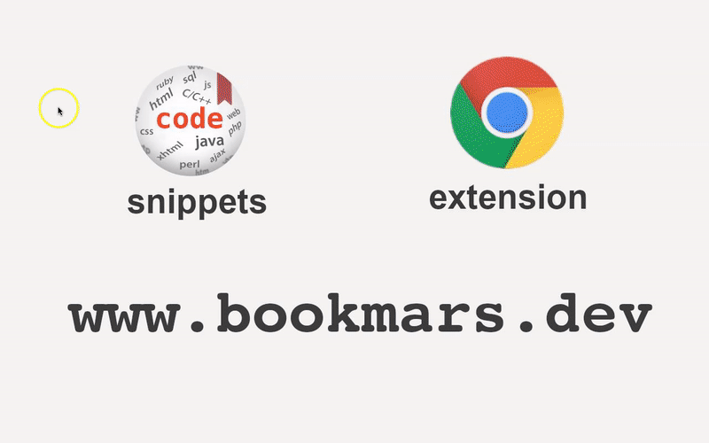
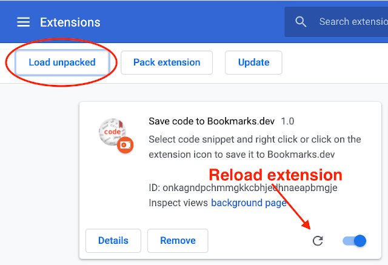
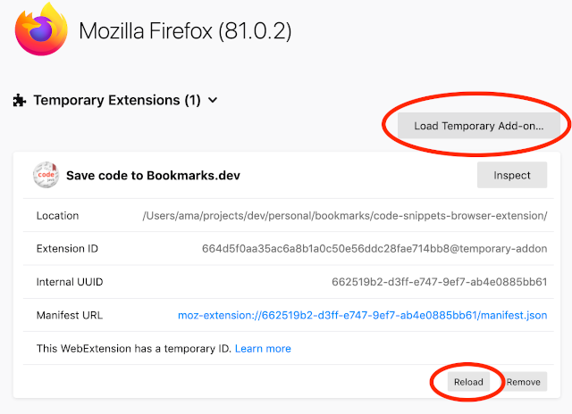

Save code to Bookmarks.dev Browser Extension
---
Browser extension to save code snippets to [www.bookmarks.dev](https://www.bookmarks.dev), 
the Bookmarks and Code Snippets Manager for Developers & Co. 

## Install
This browser extension is available for:

| [](https://chrome.google.com/webstore/detail/save-code-to-bookmarksdev/mibimnflfgnaealndgnamblppebdngne) | [](https://addons.mozilla.org/en-GB/firefox/addon/save-code-to-bookmarks-dev/) |
|:---:|:---:|
| [Chrome](https://chrome.google.com/webstore/detail/save-code-to-bookmarksdev/mibimnflfgnaealndgnamblppebdngne) | [Firefox](https://addons.mozilla.org/en-GB/firefox/addon/save-code-to-bookmarks-dev/) |

> If your company blocks Browser Extensions, or you have a tight security blocking pop-up windows from extensions 
> you can use the [our bookmarklets](https://www.bookmarks.dev/bookmarklets) which offer the same functionality 

## How to use
Select code snippet && (right click || click on extension icon) to save it to [Bookmarks.dev](https://www.bookmarks.dev).

A popup window is launched where you can add additional metadata to the code snippet record.



> You need to have an account to save code to your code snippets

> For youtube videos and stackoverflow questions the **tags** auto-completed

## Testing locally
Check out the git repository - `git clone https://github.com/BookmarksDev/code-snippets-browser-extension`

### Chrome/Brave
Go to [chrome://extensions/](chrome://extensions/), click **Load unpacked** and select the `code-snippets-browser-extension` folder
where you have checked it out:



> Click "Reload" on the extension when you do modifications 

### Firefox
#### Use [web-ext](https://github.com/mozilla/web-ext)
The easiest way is to use [web-ext](https://github.com/mozilla/web-ext)
 You can install it globally for example via
```
npm install --global web-ext
```
and then run the following command in the root directory of the project

```
web-ext run
```

This installs "Save code to Bookmarks.dev" as a temporary add-on and it watches for changes in the source code
and **redeploys automatically**.

#### Manual deployment
Go to [about:debugging#/runtime/this-firefox](about:debugging#/runtime/this-firefox), click **Load Temporary Add-on...**
 and select the `manifest.json` file from the `code-snippets-browser-extension` folder where you have checked it out:



> Click "Reload" on the extension when you do modifications 

### Test the extension against the [`localhost`](https://github.com/BookmarksDev/bookmarks.dev) version of Bookmarks.dev 
Change the `host` url in the following line from [launch-bookmarksdev-dialog.js](launch-bookmarksdev-dialog.js):
```
const url = 'https://www.bookmarks.dev/my-codelets/new?sourceUrl=' + encodeURIComponent(l) + '&code=' + encodeURIComponent(d) + '&title=' + encodeURIComponent(t) + '&popup=true'
```
to
```
const url = 'http://localhost:4200/my-codelets/new?sourceUrl=' + encodeURIComponent(l) + '&code=' + encodeURIComponent(d) + '&title=' + encodeURIComponent(t) + '&popup=true'
```

and then Reload the extension with one of the mechanisms mentioned before

## Publish browser extension to official stores

First of all zip the file either with `web-ext`
```
web-ext build -i 'resources'
```

or with _standard_ `zip` command:
```
zip -r releases/code-snippets.bookmarks.dev.chrome.extension.zip * -x *.idea* *.git* '*resources/*' '*web-ext-artifacts/*'
```


### Publish to Google Chrome Webstore
Go to [Chrome Webstore Dashboard](https://chrome.google.com/webstore/developer/dashboard) where
you upload the .zip file. Wait for a couple of business days for an approval.

### Publish to [Firefox Webstore](https://extensionworkshop.com/documentation/publish/)

